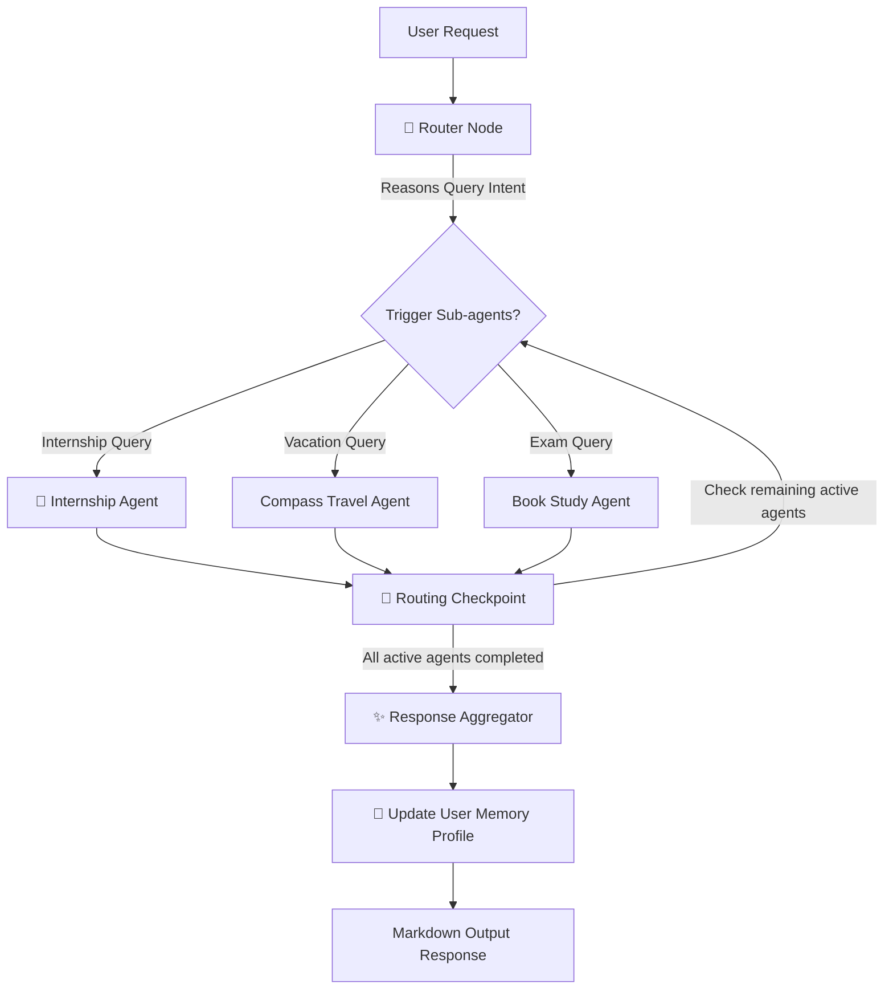

# CampusCopilot AI

> **Tagline**: "Your Personal AI Career & Student Assistant"  
> **A complete multi-agent AI system powered by LangGraph, FastAPI, and React + TypeScript + Tailwind CSS.**

---

## 🌟 Key Features

1. **Authentication**: JWT token-based secure signup, login, and profile loading.
2. **Autonomous AI Planner (Main Brain)**: The router node determines user intents and invokes the correct sub-agent chain without needing direct page triggers.
3. **9 Specialized Agent Nodes**:
   - **Internship Agent**: Calculates ATS scores and recommends roles.
   - **Hackathon Agent**: Scrapes registrations and deadlines.
   - **Scholarship Agent**: Filters opportunities by GPA and income boundaries.
   - **Resume Agent**: Suggests project expansions and cover letter drafts.
   - **Study Planner Agent**: Generates timetable revision grids.
   - **Finance Agent**: Tracks transactions and warns on overspending.
   - **Shopping Agent**: Price matches and lists active student coupons.
   - **Health Agent**: Calorie trackers and workout builders.
   - **Travel Agent**: Formulates पैकिंग (packing) checklists and schedules itineraries.
4. **Shared Session Memory**: Profile data is persisted in a local database and synced inside the Agent memory workspace.
5. **Interactive UI Panels**: Stunning dark-themed glassmorphism layout using Framer Motion and Lucide icons.

---

## 📁 Repository Structure

```
D:\antigrav\AllInOneAi\
├── backend/
│   ├── app/
│   │   ├── auth/            # Security protocols and JWT routers
│   │   ├── database/        # SQLite database models and sessions
│   │   ├── schemas/         # Pydantic validation structures
│   │   ├── services/        # Business logic modules
│   │   ├── tools/           # Tavily web search, PyPDF parser, Calendar stubs
│   │   ├── utils/           # OpenAI/Gemini LLM wrapper and local rule matcher
│   │   ├── agents/          # LangGraph framework definitions
│   │   │   ├── specialized/ # Individual processing agent sub-nodes
│   │   │   ├── state.py     # TypedDict Graph State
│   │   │   ├── planner.py   # Router node and Compiler node
│   │   │   └── graph.py     # Compiled StateGraph workflow builder
│   │   └── main.py          # FastAPI server entry point
│   ├── requirements.txt
│   └── .env.example
└── frontend/
    ├── src/
    │   ├── components/      # Glassmorphic Sidebar and Headers
    │   ├── pages/           # Landing, Auth, Chat, and 9 agent views
    │   ├── context/         # Auth and Theme provider states
    │   ├── App.tsx          # Client Router and auth switches
    │   ├── main.tsx         # React app mounting point
    │   └── index.css        # Core styling parameters
    ├── tailwind.config.js
    ├── package.json
    └── vite.config.ts
```

---

## 🛠️ Installation & Setup

### 1. Backend Server Setup
Navigate into the backend folder, configure virtual environments, and install libraries:
```bash
# Navigate to backend
cd backend

# Create virtual environment
python -m venv venv
venv\Scripts\activate

# Install libraries
pip install -r requirements.txt

# Create environment file
cp .env.example .env
```
Update `.env` with your API credentials (optional, stubs handles empty values):
- `OPENAI_API_KEY` / `GEMINI_API_KEY`
- `TAVILY_API_KEY`

Start the FastAPI application:
```bash
uvicorn app.main:app --host 127.0.0.1 --port 8000 --reload
```

---

### 2. Frontend client Setup
Navigate into the frontend folder and install npm packages:
```bash
# Navigate to frontend
cd ../frontend

# Install dependencies
npm install

# Run Vite dev server
npm run dev
```
The client dashboard loads on: **`http://localhost:3000`**

---

## 📊 Database Entities Schema

The SQLite schema initializes the following relational tables automatically at startup:
- `users`: Stores emails and hashed credentials.
- `user_profiles`: Stores Branch, CGPA, target companies, skills array, and parsed resume text.
- `internship_applications`: Kanban tracker columns.
- `hackathon_registrations`: Competitive registries.
- `scholarship_applications`: Buddy4Study details.
- `calendar_events`: Scheduled study sessions and exams.
- `expenses`: Category-based allowances ledger.
- `study_plans`: Checklists for exams.
- `health_records`: Calorie logs.
- `travel_plans`: Trip destination details.
- `chat_messages`: Session history.

---

## 🤖 Agent Execution Flow


