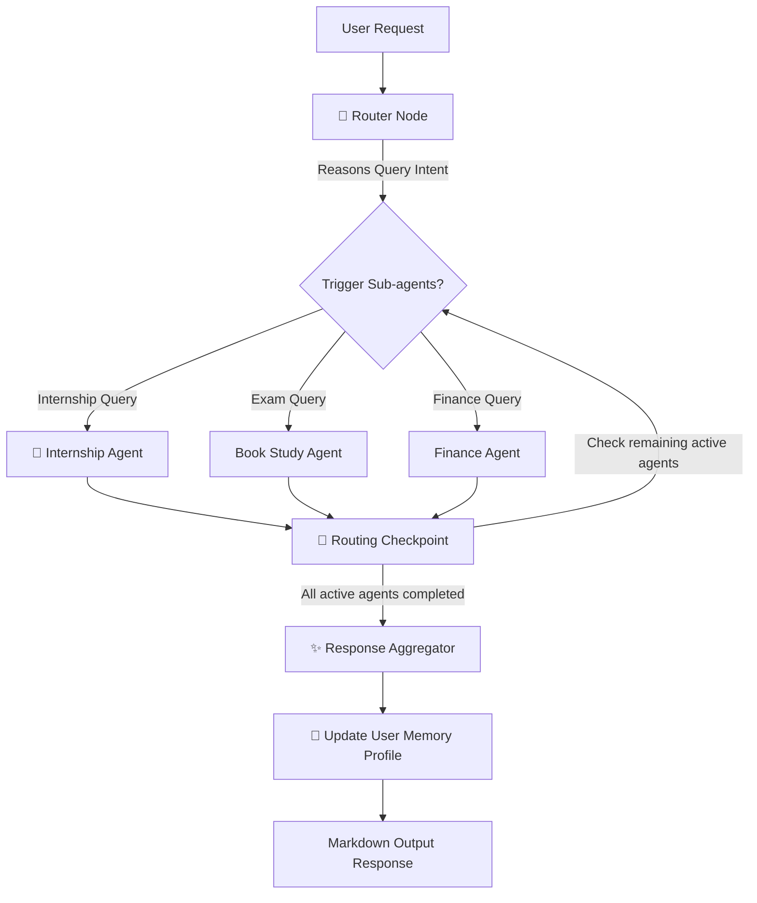

# CampusCopilot AI (Upgraded Edition)

> **Tagline**: "Your Personal AI Career & Student Assistant"  
> **A complete multi-agent AI system powered by LangGraph, FastAPI, and React + TypeScript + Tailwind CSS.**

---

## 🌟 Upgraded Key Features

1. **Authentication**: JWT token-based secure signup, login, and profile loading.
2. **Autonomous AI Planner (Main Brain)**: The router node determines user intents and invokes the correct sub-agent chain without needing direct page triggers.
3. **7 Specialized Agent Nodes**:
   - **Internship Agent**: Calculates ATS scores and recommends roles.
   - **Hackathon Agent**: Scrapes registrations and deadlines.
   - **Scholarship Agent**: Filters opportunities by GPA and income boundaries.
   - **Resume Agent**: Suggests project expansions and cover letter drafts.
   - **Study Planner Agent**: Generates timetable revision grids and visualizes them.
   - **Finance Agent**: Tracks transactions, models allowance channels, and ticks net worth.
   - **Shopping Agent**: Price matches, compares Indian retail deals in Rupees, and registers coupons.
4. **🌌 StudyVerse Galaxy & Study Planner (Syllabus-Only)**:
   - **Interactive Galaxy canvas**: Renders active subjects as orbiting planets and tasks as moons on an HTML5 canvas, complete with a neon spaceship particle path.
   - **AI Timetable Generator**: Builds advanced daily/weekly tables with Time, Type, focus topic, and target goals using Gemini, mapped exactly to your input syllabus context.
   - **AI Tutor Console & PDF Quizzes**: Explain topics in simple terms with analogies, supports localized Hindi and Kannada explanations (including custom queries like "radar"), generates multiple difficulties quizzes, and schedules spaced-repetition flashcards.
   - **Draggable Physics Mind Map**: Interactive blueprint canvas utilizing spring-mass damping physics for manual nodes dragging, connected by neon particle pulses running along connection paths.
5. **💸 Ultimate Finance Dashboard (Apple-level UI)**:
   - **Animated 3D Globe**: Rotating wireframe canvas displaying spending concentrations by region.
   - **Smooth Net-Worth Count**: Ticking counter animations showing allowances and disposable funds.
   - **Cash-Flow River SVG**: A flowing stream visualization mapping monthly cash flow channels.
   - **Nifty Stocks & Tata Tickers**: Flashing indices displaying Tata Motors and Nifty 50 values in Indian Rupees (₹) with real-time green/red price indicators.
6. **🛒 Smart Shopping Rupee Price Scraper**:
   - **flash.co branding**: Curated shopping headers and price compare logs.
   - **Tavily Price Scraper**: Live search comparison querying Tavily for `{query} price in india amazon.in flipkart.com croma.com`, dynamically parsing Rupee values and generating direct links.
7. **📅 Dynamic Unified Calendar Sync**:
   - Dynamically compiles upcoming events, deadlines, and dates from Internships, Hackathons, Scholarships, and Study plans into a single unified calendar dashboard on the fly.
8. **Shared Session Memory**: Profile data is persisted in a local database and synced inside the Agent memory workspace.

---

## 📁 Repository Structure

```
D:\antigrav\AllInOneAi\
├── backend/
├── app/
│   ├── auth/            # Security protocols and JWT routers
│   ├── database/        # SQLite database models and sessions
│   ├── schemas/         # Pydantic validation structures
│   ├── services/        # Business logic modules
│   ├── tools/           # Tavily web search, PyPDF parser, Calendar stubs
│   ├── utils/           # OpenAI/Gemini LLM wrapper and local rule matcher
│   ├── agents/          # LangGraph framework definitions
│   │   ├── specialized/ # Individual processing agent sub-nodes (decommissioned Health & Travel)
│   │   ├── state.py     # TypedDict Graph State
│   │   ├── planner.py   # Router node and Compiler node
│   │   └── graph.py     # Compiled StateGraph workflow builder
│   └── main.py          # FastAPI server entry point (port 8001)
│   ├── requirements.txt
│   └── .env.example
└── frontend/
    ├── src/
    │   ├── components/      # Glassmorphic Sidebar and Headers
    │   ├── pages/           # Landing, Auth, Chat, and 7 agent views (StudyPlanner, Finance, Shopping, etc.)
    │   ├── context/         # Auth and Theme provider states
    │   ├── App.tsx          # Client Router and auth switches
    │   ├── main.tsx         # React app mounting point
    │   └── index.css        # Core styling parameters
    ├── tailwind.config.js
    ├── package.json
    └── vite.config.ts
```

---

## 🛠️ Installation & Setup

### 1. Backend Server Setup
Navigate into the backend folder, configure virtual environments, and install libraries:
```bash
# Navigate to backend
cd backend

# Create virtual environment
python -m venv venv
venv\Scripts\activate

# Install libraries
pip install -r requirements.txt

# Create environment file
cp .env.example .env
```
Update `.env` with your API credentials:
- `OPENAI_API_KEY` / `GEMINI_API_KEY`
- `TAVILY_API_KEY`

Start the FastAPI application on **Port 8001** (port 8000 bypasses zombie locks):
```bash
uvicorn app.main:app --host 127.0.0.1 --port 8001 --reload
```

---

### 2. Frontend Client Setup
Navigate into the frontend folder and install npm packages:
```bash
# Navigate to frontend
cd ../frontend

# Install dependencies
npm install

# Run Vite dev server
npm run dev
```
The client dashboard loads on: **`http://localhost:3000`** (Requests proxy to backend port `8001`).

---

## 📊 Database Entities Schema

The SQLite database schema initializes the following relational tables automatically at startup:
- `users`: Stores emails and hashed credentials.
- `user_profiles`: Stores Branch, CGPA, target companies, skills array, and parsed resume text.
- `internship_applications`: Kanban tracker columns.
- `hackathon_registrations`: Competitive registries.
- `scholarship_applications`: Buddy4Study details.
- `calendar_events`: Scheduled study sessions and exams.
- `expenses`: Category-based allowances ledger.
- `study_plans`: Checklists for exams.
- `chat_messages`: Session history.

---

## 🤖 Agent Execution Flow


